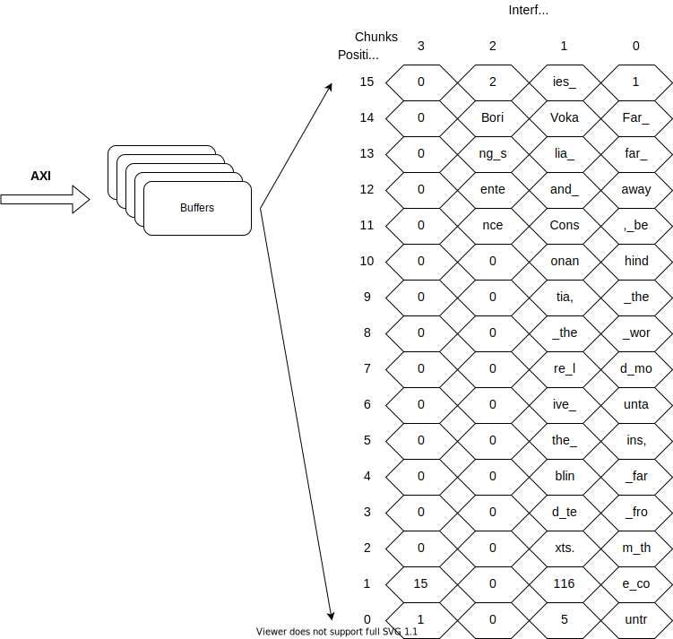

# How do you configure the crossbars.

First things first, the interface is setup in a way where it makes sense to use 32bits as the smallest data size to describe the system. We mostly use 32bit integers so I'll be refering to integers mostly in the following description to make it easier to follow.

## Configuration data size

The crossbars are between the buffer and the interface. First, what does the data in the buffers look like? The data is pumped to the buffers using AXI bursts which in the current design can last up to 128 cycles where each cycle can transfer 4 integers of data (4 times 32bits). The data in the buffers is consecutive with no garbage data in between the records. 

### Example introduction

Now how do we configure the crossbar to move the data from the buffers to the interface wires? Let's go through a simple example. We have a table where each record is 32 integers large. You can see the columns and their sizes below:

ID - 1 | Sentence - 29 | Length - 1 | Rating - 1
------------ | ------------- | ------------- | -------------
1|Far far away, behind the word mountains, far from the countries Vokalia and Consonantia, there live the blind texts.|116|5
2|Boring sentence|15|1

Let's say we want to see the whole table in the original order on the interface as well as shown in the figure below. 

<center></center>

To do that we need to understand how much we need to configure. Each buffer can have 32 chunks of data in it where each chunk is 16 integers large. Thus one buffer can currently hold 2KB of data at a time. The crossbar has to be configured to map each integer in time and space to the interface wires. Do we then write more than 2KB of configuration data to give coordinates for each integer? No, in our case we configure an AXI burst size worth of records. Each burst has a full number of records transferred. So we need to configure records per burst amount of data. In our example the system would be configured to transfer 16 (512/32) records per burst and each record is fit into 2 (32/16) chunks of data. So we would need to configure 32 chunks of data which is 512 integers. 

As a side note, the system can only transfer power of 2 number of records. And it can't transfer more than 32 records. In our case 16 is a power of 2 and it is less than 32. But it if was more than 32 then we'd just choose 32 instead and if it wasn't a power of 2 we'd choose the next available power of 2 number.

## Input crossbar configuration

Now, the configuration is done in 2 phases. First we configure the chunk selection and then the position within the chunk selection. 

### Base chunk selection

0 | 1 | 2 | 3 | 4 | 5 | 6 | 7 | 8 | 9 | 10 | 11 | 12 | 13 | 14 | 15
--|--|--|--|--|--|--|--|--|--|--|--|--|--|--|--
0|0|0|0|0|0|0|0|0|0|0|0|0|0|0|***0***
1|1|1|1|1|1|1|1|1|1|1|1|1|1|1|*1*
2|2|2|2|2|2|2|2|2|2|2|2|2|2|2|*2*
3|3|3|3|3|3|3|3|3|3|3|3|3|3|3|*3*
4|4|4|4|4|4|4|4|4|4|4|4|4|4|4|*4*
5|5|5|5|5|5|5|5|5|5|5|5|5|5|5|*5*
6|6|6|6|6|6|6|6|6|6|6|6|6|6|6|*6*
7|7|7|7|7|7|7|7|7|7|7|7|7|7|7|*7*
8|8|8|8|8|8|8|8|8|8|8|8|8|8|8|*8*
9|9|9|9|9|9|9|9|9|9|9|9|9|9|9|*9*
10|10|10|10|10|10|10|10|10|10|10|10|10|10|10|*10*
11|11|11|11|11|11|11|11|11|11|11|11|11|11|11|*11*
12|12|12|12|12|12|12|12|12|12|12|12|12|12|12|*12*
13|13|13|13|13|13|13|13|13|13|13|13|13|13|13|*13*
14|14|14|14|14|14|14|14|14|14|14|14|14|14|14|*14*
15|15|15|15|15|15|15|15|15|15|15|15|15|15|15|*15*
16|16|16|16|16|16|16|16|16|16|16|16|16|16|16|*16*
17|17|17|17|17|17|17|17|17|17|17|17|17|17|17|*17*
18|18|18|18|18|18|18|18|18|18|18|18|18|18|18|*18*
19|19|19|19|19|19|19|19|19|19|19|19|19|19|19|*19*
20|20|20|20|20|20|20|20|20|20|20|20|20|20|20|*20*
21|21|21|21|21|21|21|21|21|21|21|21|21|21|21|*21*
22|22|22|22|22|22|22|22|22|22|22|22|22|22|22|*22*
23|23|23|23|23|23|23|23|23|23|23|23|23|23|23|*23*
24|24|24|24|24|24|24|24|24|24|24|24|24|24|24|*24*
25|25|25|25|25|25|25|25|25|25|25|25|25|25|25|*25*
26|26|26|26|26|26|26|26|26|26|26|26|26|26|26|*26*
27|27|27|27|27|27|27|27|27|27|27|27|27|27|27|*27*
28|28|28|28|28|28|28|28|28|28|28|28|28|28|28|*28*
29|29|29|29|29|29|29|29|29|29|29|29|29|29|29|*29*
30|30|30|30|30|30|30|30|30|30|30|30|30|30|30|*30*
31|31|31|31|31|31|31|31|31|31|31|31|31|31|31|*31*

### Base position selection

0 | 1 | 2 | 3 | 4 | 5 | 6 | 7 | 8 | 9 | 10 | 11 | 12 | 13 | 14 | 15
--|--|--|--|--|--|--|--|--|--|--|--|--|--|--|--
*0*| *1* | *2* | *3* | *4* | *5* | *6* | *7* |*8* | *9* | *10* | *11* | *12* | *13* | *14*| ***15***
0 | 1 | 2 | 3 | 4 | 5 | 6 | 7 | 8 | 9 | 10 | 11 | 12 | 13 | 14 | 15
0 | 1 | 2 | 3 | 4 | 5 | 6 | 7 | 8 | 9 | 10 | 11 | 12 | 13 | 14 | 15
0 | 1 | 2 | 3 | 4 | 5 | 6 | 7 | 8 | 9 | 10 | 11 | 12 | 13 | 14 | 15
0 | 1 | 2 | 3 | 4 | 5 | 6 | 7 | 8 | 9 | 10 | 11 | 12 | 13 | 14 | 15
0 | 1 | 2 | 3 | 4 | 5 | 6 | 7 | 8 | 9 | 10 | 11 | 12 | 13 | 14 | 15
0 | 1 | 2 | 3 | 4 | 5 | 6 | 7 | 8 | 9 | 10 | 11 | 12 | 13 | 14 | 15
0 | 1 | 2 | 3 | 4 | 5 | 6 | 7 | 8 | 9 | 10 | 11 | 12 | 13 | 14 | 15
0 | 1 | 2 | 3 | 4 | 5 | 6 | 7 | 8 | 9 | 10 | 11 | 12 | 13 | 14 | 15
0 | 1 | 2 | 3 | 4 | 5 | 6 | 7 | 8 | 9 | 10 | 11 | 12 | 13 | 14 | 15
0 | 1 | 2 | 3 | 4 | 5 | 6 | 7 | 8 | 9 | 10 | 11 | 12 | 13 | 14 | 15
0 | 1 | 2 | 3 | 4 | 5 | 6 | 7 | 8 | 9 | 10 | 11 | 12 | 13 | 14 | 15
0 | 1 | 2 | 3 | 4 | 5 | 6 | 7 | 8 | 9 | 10 | 11 | 12 | 13 | 14 | 15
0 | 1 | 2 | 3 | 4 | 5 | 6 | 7 | 8 | 9 | 10 | 11 | 12 | 13 | 14 | 15
0 | 1 | 2 | 3 | 4 | 5 | 6 | 7 | 8 | 9 | 10 | 11 | 12 | 13 | 14 | 15
0 | 1 | 2 | 3 | 4 | 5 | 6 | 7 | 8 | 9 | 10 | 11 | 12 | 13 | 14 | 15
0 | 1 | 2 | 3 | 4 | 5 | 6 | 7 | 8 | 9 | 10 | 11 | 12 | 13 | 14 | 15
0 | 1 | 2 | 3 | 4 | 5 | 6 | 7 | 8 | 9 | 10 | 11 | 12 | 13 | 14 | 15
0 | 1 | 2 | 3 | 4 | 5 | 6 | 7 | 8 | 9 | 10 | 11 | 12 | 13 | 14 | 15
0 | 1 | 2 | 3 | 4 | 5 | 6 | 7 | 8 | 9 | 10 | 11 | 12 | 13 | 14 | 15
0 | 1 | 2 | 3 | 4 | 5 | 6 | 7 | 8 | 9 | 10 | 11 | 12 | 13 | 14 | 15
0 | 1 | 2 | 3 | 4 | 5 | 6 | 7 | 8 | 9 | 10 | 11 | 12 | 13 | 14 | 15
0 | 1 | 2 | 3 | 4 | 5 | 6 | 7 | 8 | 9 | 10 | 11 | 12 | 13 | 14 | 15
0 | 1 | 2 | 3 | 4 | 5 | 6 | 7 | 8 | 9 | 10 | 11 | 12 | 13 | 14 | 15
0 | 1 | 2 | 3 | 4 | 5 | 6 | 7 | 8 | 9 | 10 | 11 | 12 | 13 | 14 | 15
0 | 1 | 2 | 3 | 4 | 5 | 6 | 7 | 8 | 9 | 10 | 11 | 12 | 13 | 14 | 15
0 | 1 | 2 | 3 | 4 | 5 | 6 | 7 | 8 | 9 | 10 | 11 | 12 | 13 | 14 | 15
0 | 1 | 2 | 3 | 4 | 5 | 6 | 7 | 8 | 9 | 10 | 11 | 12 | 13 | 14 | 15
0 | 1 | 2 | 3 | 4 | 5 | 6 | 7 | 8 | 9 | 10 | 11 | 12 | 13 | 14 | 15
0 | 1 | 2 | 3 | 4 | 5 | 6 | 7 | 8 | 9 | 10 | 11 | 12 | 13 | 14 | 15
0 | 1 | 2 | 3 | 4 | 5 | 6 | 7 | 8 | 9 | 10 | 11 | 12 | 13 | 14 | 15
0 | 1 | 2 | 3 | 4 | 5 | 6 | 7 | 8 | 9 | 10 | 11 | 12 | 13 | 14 | 15

This is a simple example but we can see that for the first integer we select it to be from the 1st (i=0) chunk. And we do the same for all other integers. After the first phase we start looking for positions within the chunk. Again for the first integer we select it to be from the first (i=15) position within the chunk. We can think of phase one shuffling data vertically and then afterward phase two shuffles data horisontally.

## Configuration parameters and shuffling

But that was a trivial case with no actual shuffling. What if we don't want all of the columns on the interface? Then we can start ignoring some of the data and shifting the data we want. The way we can configure the crossbar configuration itself is by specifying the size of the initial record and then a vector of integer indexes. For the previous configuration the input would have been:

```
record_size = 32;
selected_columns = {0,1,2,3,...,30,31};
```

Let's say we only want the string data and none of the integer data from our table. In that case the input will be:

```
record_size = 32;
selected_columns = {1,2,3,...,28,29};
```

We can see that we are not interested in the first and the last two integers for each record. To show which configuration inputs mark the garbage data I use X but in reality the FPGA will recieve chunk ID 31 and position 0 configuration for those integers marked with X below.  

### Reduced chunk selection

0 | 1 | 2 | 3 | 4 | 5 | 6 | 7 | 8 | 9 | 10 | 11 | 12 | 13 | 14 | 15
--|--|--|--|--|--|--|--|--|--|--|--|--|--|--|--
0|0|0|0|0|0|0|0|0|0|0|0|0|0|0|***1***
X|X|1|1|1|1|1|1|1|1|1|1|1|1|1|*X*
2|2|2|2|2|2|2|2|2|2|2|2|2|2|2|*3*
X|X|3|3|3|3|3|3|3|3|3|3|3|3|3|*X*
4|4|4|4|4|4|4|4|4|4|4|4|4|4|4|*5*
X|X|5|5|5|5|5|5|5|5|5|5|5|5|5|*X*
6|6|6|6|6|6|6|6|6|6|6|6|6|6|6|*7*
X|X|7|7|7|7|7|7|7|7|7|7|7|7|7|*X*
8|8|8|8|8|8|8|8|8|8|8|8|8|8|8|*9*
X|X|9|9|9|9|9|9|9|9|9|9|9|9|9|*X*
10|10|10|10|10|10|10|10|10|10|10|10|10|10|10|*11*
X|X|11|11|11|11|11|11|11|11|11|11|11|11|11|*X*
12|12|12|12|12|12|12|12|12|12|12|12|12|12|12|*13*
X|X|13|13|13|13|13|13|13|13|13|13|13|13|13|*X*
14|14|14|14|14|14|14|14|14|14|14|14|14|14|14|*15*
X|X|15|15|15|15|15|15|15|15|15|15|15|15|15|*X*
16|16|16|16|16|16|16|16|16|16|16|16|16|16|16|*17*
X|X|17|17|17|17|17|17|17|17|17|17|17|17|17|*X*
18|18|18|18|18|18|18|18|18|18|18|18|18|18|18|*19*
X|X|19|19|19|19|19|19|19|19|19|19|19|19|19|*X*
20|20|20|20|20|20|20|20|20|20|20|20|20|20|20|*21*
X|X|21|21|21|21|21|21|21|21|21|21|21|21|21|*X*
22|22|22|22|22|22|22|22|22|22|22|22|22|22|22|*23*
X|X|23|23|23|23|23|23|23|23|23|23|23|23|23|*X*
24|24|24|24|24|24|24|24|24|24|24|24|24|24|24|*25*
X|X|25|25|25|25|25|25|25|25|25|25|25|25|25|*X*
26|26|26|26|26|26|26|26|26|26|26|26|26|26|26|*27*
X|X|27|27|27|27|27|27|27|27|27|27|27|27|27|*X*
28|28|28|28|28|28|28|28|28|28|28|28|28|28|28|*29*
X|X|29|29|29|29|29|29|29|29|29|29|29|29|29|*X*
30|30|30|30|30|30|30|30|30|30|30|30|30|30|30|*31*
X|X|31|31|31|31|31|31|31|31|31|31|31|31|31|*X*

### Reduced position selection

0 | 1 | 2 | 3 | 4 | 5 | 6 | 7 | 8 | 9 | 10 | 11 | 12 | 13 | 14 | 15
--|--|--|--|--|--|--|--|--|--|--|--|--|--|--|--
*15*| *0* | *1*| *2* | *3*| *4* |*5*| *6*|*7* | *8*| *9*| *10* | *11* |*12* |*13* | ***14***
X | X | X | 2| 3 | 4 | 5 | 6 | 7 | 8 | 9 | 10 | 11 | 12 | 13 | 14 
15| 0 | 1 | 2 | 3 | 4 | 5 | 6 | 7 | 8 | 9 | 10 | 11 | 12 | 13 | 14
X | X | X | 2| 3 | 4 | 5 | 6 | 7 | 8 | 9 | 10 | 11 | 12 | 13 | 14 
15| 0 | 1 | 2 | 3 | 4 | 5 | 6 | 7 | 8 | 9 | 10 | 11 | 12 | 13 | 14
X | X | X | 2| 3 | 4 | 5 | 6 | 7 | 8 | 9 | 10 | 11 | 12 | 13 | 14 
15| 0 | 1 | 2 | 3 | 4 | 5 | 6 | 7 | 8 | 9 | 10 | 11 | 12 | 13 | 14
X | X | X | 2| 3 | 4 | 5 | 6 | 7 | 8 | 9 | 10 | 11 | 12 | 13 | 14 
15| 0 | 1 | 2 | 3 | 4 | 5 | 6 | 7 | 8 | 9 | 10 | 11 | 12 | 13 | 14
X | X | X | 2| 3 | 4 | 5 | 6 | 7 | 8 | 9 | 10 | 11 | 12 | 13 | 14 
15| 0 | 1 | 2 | 3 | 4 | 5 | 6 | 7 | 8 | 9 | 10 | 11 | 12 | 13 | 14
X | X | X | 2| 3 | 4 | 5 | 6 | 7 | 8 | 9 | 10 | 11 | 12 | 13 | 14 
15| 0 | 1 | 2 | 3 | 4 | 5 | 6 | 7 | 8 | 9 | 10 | 11 | 12 | 13 | 14
X | X | X | 2| 3 | 4 | 5 | 6 | 7 | 8 | 9 | 10 | 11 | 12 | 13 | 14 
15| 0 | 1 | 2 | 3 | 4 | 5 | 6 | 7 | 8 | 9 | 10 | 11 | 12 | 13 | 14
X | X | X | 2| 3 | 4 | 5 | 6 | 7 | 8 | 9 | 10 | 11 | 12 | 13 | 14 
15| 0 | 1 | 2 | 3 | 4 | 5 | 6 | 7 | 8 | 9 | 10 | 11 | 12 | 13 | 14
X | X | X | 2| 3 | 4 | 5 | 6 | 7 | 8 | 9 | 10 | 11 | 12 | 13 | 14 
15| 0 | 1 | 2 | 3 | 4 | 5 | 6 | 7 | 8 | 9 | 10 | 11 | 12 | 13 | 14
X | X | X | 2| 3 | 4 | 5 | 6 | 7 | 8 | 9 | 10 | 11 | 12 | 13 | 14 
15| 0 | 1 | 2 | 3 | 4 | 5 | 6 | 7 | 8 | 9 | 10 | 11 | 12 | 13 | 14
X | X | X | 2| 3 | 4 | 5 | 6 | 7 | 8 | 9 | 10 | 11 | 12 | 13 | 14 
15| 0 | 1 | 2 | 3 | 4 | 5 | 6 | 7 | 8 | 9 | 10 | 11 | 12 | 13 | 14
X | X | X | 2| 3 | 4 | 5 | 6 | 7 | 8 | 9 | 10 | 11 | 12 | 13 | 14 
15| 0 | 1 | 2 | 3 | 4 | 5 | 6 | 7 | 8 | 9 | 10 | 11 | 12 | 13 | 14
X | X | X | 2| 3 | 4 | 5 | 6 | 7 | 8 | 9 | 10 | 11 | 12 | 13 | 14 
15| 0 | 1 | 2 | 3 | 4 | 5 | 6 | 7 | 8 | 9 | 10 | 11 | 12 | 13 | 14
X | X | X | 2| 3 | 4 | 5 | 6 | 7 | 8 | 9 | 10 | 11 | 12 | 13 | 14 
15| 0 | 1 | 2 | 3 | 4 | 5 | 6 | 7 | 8 | 9 | 10 | 11 | 12 | 13 | 14
X | X | X | 2| 3 | 4 | 5 | 6 | 7 | 8 | 9 | 10 | 11 | 12 | 13 | 14 
15| 0 | 1 | 2 | 3 | 4 | 5 | 6 | 7 | 8 | 9 | 10 | 11 | 12 | 13 | 14
X | X | X | 2| 3 | 4 | 5 | 6 | 7 | 8 | 9 | 10 | 11 | 12 | 13 | 14 

Here we can see some of the shuffling taking place. For example, since we are not using the first integer of the orignal data we can already take the data from the next chunk and then place that with the position selection at the end of the first chunk. Thus the first integer comes from the position 14 instead!

## Output and non-aligned data

There's another crossbar to worry about as well. The one which places data at the other end of the stream. Output configuration is the other way around in terms of the 2 phases. The position is chosen first and the chunk is chosen second.

Let's continue with the example we ended with at the input side. Here we can start seeing a slight complication. Since we don't want any garbage data between the records we won't have aligned data in the buffers any more after removing some of the data columns from the original table. Every record won't start from position 0 in the chunk which ID is equal to element/16. 

We can see first the position selection and then the chunk selection configuration tables below. One thing you can notice is that the chunk selection table would be the same for the input if the table originally started with records which size is 29 integers. And we are still configuring 512 integers because of the following calculations:

```
512/29 = ~17.7
Log2(17) = ~4.1 
2^4 = 16 
16 X 2 X 16 = 512
```

### Output position selection

0 | 1 | 2 | 3 | 4 | 5 | 6 | 7 | 8 | 9 | 10 | 11 | 12 | 13 | 14 | 15
--|--|--|--|--|--|--|--|--|--|--|--|--|--|--|--
0|1|2|3|4|5|6|7|8|9|10|11|12|13|14|15
X|X|X|3|4|5|6|7|8|9|10|11|12|13|14|15
13|14|15|0|1|2|3|4|5|6|7|8|9|10|11|12
13|14|15|X|X|X|3|4|5|6|7|8|9|10|11|12
10|11|12|13|14|15|0|1|2|3|4|5|6|7|8|9
10|11|12|13|14|15|X|X|X|3|4|5|6|7|8|9
7|8|9|10|11|12|13|14|15|0|1|2|3|4|5|6
7|8|9|10|11|12|13|14|15|X|X|X|3|4|5|6
4|5|6|7|8|9|10|11|12|13|14|15|0|1|2|3
4|5|6|7|8|9|10|11|12|13|14|15|X|X|X|3
1|2|3|4|5|6|7|8|9|10|11|12|13|14|15|0
X|X|3|4|5|6|7|8|9|10|11|12|13|14|15|X
14|15|0|1|2|3|4|5|6|7|8|9|10|11|12|13
14|15|X|X|X|3|4|5|6|7|8|9|10|11|12|13
11|12|13|14|15|0|1|2|3|4|5|6|7|8|9|10
11|12|13|14|15|X|X|X|3|4|5|6|7|8|9|10
8|9|10|11|12|13|14|15|0|1|2|3|4|5|6|7
8|9|10|11|12|13|14|15|X|X|X|3|4|5|6|7
5|6|7|8|9|10|11|12|13|14|15|0|1|2|3|4
5|6|7|8|9|10|11|12|13|14|15|X|X|X|3|4
2|3|4|5|6|7|8|9|10|11|12|13|14|15|0|1
X|3|4|5|6|7|8|9|10|11|12|13|14|15|X|X
15|0|1|2|3|4|5|6|7|8|9|10|11|12|13|14
15|X|X|X|3|4|5|6|7|8|9|10|11|12|13|14
12|13|14|15|0|1|2|3|4|5|6|7|8|9|10|11
12|13|14|15|X|X|X|3|4|5|6|7|8|9|10|11
9|10|11|12|13|14|15|0|1|2|3|4|5|6|7|8
9|10|11|12|13|14|15|X|X|X|3|4|5|6|7|8
6|7|8|9|10|11|12|13|14|15|0|1|2|3|4|5
6|7|8|9|10|11|12|13|14|15|X|X|X|3|4|5
3|4|5|6|7|8|9|10|11|12|13|14|15|0|1|2
3|4|5|6|7|8|9|10|11|12|13|14|15|X|X|X

### Output chunk selection
0 | 1 | 2 | 3 | 4 | 5 | 6 | 7 | 8 | 9 | 10 | 11 | 12 | 13 | 14 | 15
--|--|--|--|--|--|--|--|--|--|--|--|--|--|--|--
0|0|0|0|0|0|0|0|0|0|0|0|0|0|0|0
X|X|X|1|1|1|1|1|1|1|1|1|1|1|1|1
1|1|1|2|2|2|2|2|2|2|2|2|2|2|2|2
2|2|2|X|X|X|3|3|3|3|3|3|3|3|3|3
3|3|3|3|3|3|4|4|4|4|4|4|4|4|4|4
4|4|4|4|4|4|X|X|X|5|5|5|5|5|5|5
5|5|5|5|5|5|5|5|5|6|6|6|6|6|6|6
6|6|6|6|6|6|6|6|6|X|X|X|7|7|7|7
7|7|7|7|7|7|7|7|7|7|7|7|8|8|8|8
8|8|8|8|8|8|8|8|8|8|8|8|X|X|X|9
9|9|9|9|9|9|9|9|9|9|9|9|9|9|9|10
X|X|10|10|10|10|10|10|10|10|10|10|10|10|10|X
10|10|11|11|11|11|11|11|11|11|11|11|11|11|11|11
11|11|X|X|X|12|12|12|12|12|12|12|12|12|12|12
12|12|12|12|12|13|13|13|13|13|13|13|13|13|13|13
13|13|13|13|13|X|X|X|14|14|14|14|14|14|14|14
14|14|14|14|14|14|14|14|15|15|15|15|15|15|15|15
15|15|15|15|15|15|15|15|X|X|X|16|16|16|16|16
16|16|16|16|16|16|16|16|16|16|16|17|17|17|17|17
17|17|17|17|17|17|17|17|17|17|17|X|X|X|18|18
18|18|18|18|18|18|18|18|18|18|18|18|18|18|19|19
X|19|19|19|19|19|19|19|19|19|19|19|19|19|X|X
19|20|20|20|20|20|20|20|20|20|20|20|20|20|20|20
20|X|X|X|21|21|21|21|21|21|21|21|21|21|21|21
21|21|21|21|22|22|22|22|22|22|22|22|22|22|22|22
22|22|22|22|X|X|X|23|23|23|23|23|23|23|23|23
23|23|23|23|23|23|23|24|24|24|24|24|24|24|24|24
24|24|24|24|24|24|24|X|X|X|25|25|25|25|25|25
25|25|25|25|25|25|25|25|25|25|26|26|26|26|26|26
26|26|26|26|26|26|26|26|26|26|X|X|X|27|27|27
27|27|27|27|27|27|27|27|27|27|27|27|27|28|28|28
28|28|28|28|28|28|28|28|28|28|28|28|28|X|X|X
 
But the position selection is different since the order of the phases is reversed. To summarise this is how you can think about input and output configurations:

* For input crossbars
	1. Select which chunk the integer should be from for that current location - **vertical selection**
	2. Select which position the integer should be from for that current location after the first selection has been made - **horisontal selection**
* For output crossbars
	1. Select which position the integer should be from for that current location - **horisontal selection**
	2. Select which chunk the integer should be from for that current location after the first selection has been made - **vertical selection** 

Non-aligned data isn't that big of a problem once you calculate how many records does it take to reach an aligned record again. Then this number of records can be iterated over and different cases have been tested against in this [unit test](../tests/dma_crossbar_setup_test.cpp) But shuffling causes a lot more problems even on its own. This is discussed in the next section.

# The issues of modifying data with the crossbars

Let's look at TPC-H table named "part". This is how the table looks like.

P_PARTKEY - 1 | P_NAME - 14 | P_MFGR - 7 | P_BRAND - 3 | P_TYPE - 7| P_SIZE - 1 | P_CONTAINER - 3 | P_RETAILPRICE - 2 | P_COMMENT - 6
------------ | ------------- | ------------- | ------------- | ------------- | ------------- | ------------- | ------------- | -------------
1|goldenrod lavender spring chocolate lace|Manufacturer#1           |Brand#13  |PROMO BURNISHED COPPER|7|JUMBO PKG |901.00|ly. slyly ironi
2|blush thistle blue yellow saddle|Manufacturer#1           |Brand#13  |LARGE BRUSHED BRASS|1|LG CASE   |902.00|lar accounts amo

Before we go into modifying the data we also need to discuss one additional quirk of the system which is only supporting power of two number of chunks per record.

## Number of chunks_per_record

The crossbar configuration is as explained before with records which are 1, 2, 4, 8, or even more chunks large. What happens if each record is 3 chunks large like it is the case for the part table from TPC-H? Well since the DMA is configured to have records with 3 chunks it will only send the 3 chunks of data to the interface. But the crossbar will have to be configured like it gets an additional made up chunk. That chunk can be ignored in the configuration. The way to do that is shown below for the chunk and position configurations for the input crossbar. In this example we assume we want all of the data from the part table in the original order on the interface wires.

### Ignored chunk chunk selection
0 | 1 | 2 | 3 | 4 | 5 | 6 | 7 | 8 | 9 | 10 | 11 | 12 | 13 | 14 | 15
--|--|--|--|--|--|--|--|--|--|--|--|--|--|--|--
0|0|0|0|0|0|0|0|0|0|0|0|0|0|0|0
1|1|1|1|1|1|1|1|1|1|1|1|1|1|1|1
X|X|X|X|2|2|2|2|2|2|2|2|2|2|2|2
X|X|X|X|X|X|X|X|X|X|X|X|X|X|X|X
2|2|2|2|3|3|3|3|3|3|3|3|3|3|3|3
3|3|3|3|4|4|4|4|4|4|4|4|4|4|4|4
4|4|4|4|X|X|X|X|5|5|5|5|5|5|5|5
X|X|X|X|X|X|X|X|X|X|X|X|X|X|X|X
5|5|5|5|5|5|5|5|6|6|6|6|6|6|6|6
6|6|6|6|6|6|6|6|7|7|7|7|7|7|7|7
7|7|7|7|7|7|7|7|X|X|X|X|8|8|8|8
X|X|X|X|X|X|X|X|X|X|X|X|X|X|X|X
8|8|8|8|8|8|8|8|8|8|8|8|9|9|9|9
9|9|9|9|9|9|9|9|9|9|9|9|10|10|10|10
10|10|10|10|10|10|10|10|10|10|10|10|X|X|X|X
X|X|X|X|X|X|X|X|X|X|X|X|X|X|X|X
11|11|11|11|11|11|11|11|11|11|11|11|11|11|11|11
12|12|12|12|12|12|12|12|12|12|12|12|12|12|12|12
X|X|X|X|13|13|13|13|13|13|13|13|13|13|13|13
X|X|X|X|X|X|X|X|X|X|X|X|X|X|X|X
13|13|13|13|14|14|14|14|14|14|14|14|14|14|14|14
14|14|14|14|15|15|15|15|15|15|15|15|15|15|15|15
15|15|15|15|X|X|X|X|16|16|16|16|16|16|16|16
X|X|X|X|X|X|X|X|X|X|X|X|X|X|X|X
16|16|16|16|16|16|16|16|17|17|17|17|17|17|17|17
17|17|17|17|17|17|17|17|18|18|18|18|18|18|18|18
18|18|18|18|18|18|18|18|X|X|X|X|19|19|19|19
X|X|X|X|X|X|X|X|X|X|X|X|X|X|X|X
19|19|19|19|19|19|19|19|19|19|19|19|20|20|20|20
20|20|20|20|20|20|20|20|20|20|20|20|21|21|21|21
21|21|21|21|21|21|21|21|21|21|21|21|X|X|X|X
X|X|X|X|X|X|X|X|X|X|X|X|X|X|X|X

### Ignored chunk position selection
0 | 1 | 2 | 3 | 4 | 5 | 6 | 7 | 8 | 9 | 10 | 11 | 12 | 13 | 14 | 15
--|--|--|--|--|--|--|--|--|--|--|--|--|--|--|--
0|1|2|3|4|5|6|7|8|9|10|11|12|13|14|15
0|1|2|3|4|5|6|7|8|9|10|11|12|13|14|15
X|X|X|X|4|5|6|7|8|9|10|11|12|13|14|15
X|X|X|X|X|X|X|X|X|X|X|X|X|X|X|X
4|5|6|7|8|9|10|11|12|13|14|15|0|1|2|3
4|5|6|7|8|9|10|11|12|13|14|15|0|1|2|3
X|X|X|X|8|9|10|11|12|13|14|15|0|1|2|3
X|X|X|X|X|X|X|X|X|X|X|X|X|X|X|X
8|9|10|11|12|13|14|15|0|1|2|3|4|5|6|7
8|9|10|11|12|13|14|15|0|1|2|3|4|5|6|7
X|X|X|X|12|13|14|15|0|1|2|3|4|5|6|7
X|X|X|X|X|X|X|X|X|X|X|X|X|X|X|X
12|13|14|15|0|1|2|3|4|5|6|7|8|9|10|11
12|13|14|15|0|1|2|3|4|5|6|7|8|9|10|11
X|X|X|X|0|1|2|3|4|5|6|7|8|9|10|11
X|X|X|X|X|X|X|X|X|X|X|X|X|X|X|X
0|1|2|3|4|5|6|7|8|9|10|11|12|13|14|15
0|1|2|3|4|5|6|7|8|9|10|11|12|13|14|15
X|X|X|X|4|5|6|7|8|9|10|11|12|13|14|15
X|X|X|X|X|X|X|X|X|X|X|X|X|X|X|X
4|5|6|7|8|9|10|11|12|13|14|15|0|1|2|3
4|5|6|7|8|9|10|11|12|13|14|15|0|1|2|3
X|X|X|X|8|9|10|11|12|13|14|15|0|1|2|3
X|X|X|X|X|X|X|X|X|X|X|X|X|X|X|X
8|9|10|11|12|13|14|15|0|1|2|3|4|5|6|7
8|9|10|11|12|13|14|15|0|1|2|3|4|5|6|7
X|X|X|X|12|13|14|15|0|1|2|3|4|5|6|7
X|X|X|X|X|X|X|X|X|X|X|X|X|X|X|X
12|13|14|15|0|1|2|3|4|5|6|7|8|9|10|11
12|13|14|15|0|1|2|3|4|5|6|7|8|9|10|11
X|X|X|X|0|1|2|3|4|5|6|7|8|9|10|11
X|X|X|X|X|X|X|X|X|X|X|X|X|X|X|X

## Problems with shuffling

We want to do the following actions with the crossbars:

1. Reorder data 
2. Remove data 
3. Duplicate data

These requirements can be specified with the parameters for the configuration. If you want to duplicate the first integer 4 times but remove the rest of the integers in a 4 integer record you can use the following input:

```
record_size = 32;
selected_columns = {1,1,1,1};
```

To see how all of these operations work we will go over through some examples. 

### Reordering data

First let's look at reordering data. To reorder data you can move it horisontally and vertically. The next example will go through the reordering options in the following order:

1. Moving horisontally 
2. Moving vertically
3. Moving diagonally
	1. Working version
	2. Non-Working version

Let's assume we want to change this orignal data

<!-- -->|<!-- -->|<!-- -->
-|-|-
1|a|A
2|b|B
3|c|C
4|d|D
5|e|E
6|f|F
7|g|G

And we want to reorder the data to finally look like this after the input crossbar

<!-- -->|<!-- -->|<!-- -->
-|-|-
A|a|1
3|b|C
2|c|B
d|5|D
4|e|E
6|7|F
f|g|G

So for the first option of moving horisontally we use these settings:

Chunk selection:

<!-- -->|<!-- -->|<!-- -->
-|-|-
0|0|0

Position selection:

<!-- -->|<!-- -->|<!-- -->
-|-|-
2|1|0

For the second option of moving vertically we use these settings:

Chunk selection:

<!-- -->|<!-- -->|<!-- -->
-|-|-
2|1|2
1|2|1

Position selection:

<!-- -->|<!-- -->|<!-- -->
-|-|-
0|1|2
0|1|2

For the third working diagonal option we use these settings:

Chunk selection:

<!-- -->|<!-- -->|<!-- -->
-|-|-
4|3|3
3|4|4

Position selection:

<!-- -->|<!-- -->|<!-- -->
-|-|-
1|0|2
0|1|2

But now for the non-working diagonal case. We can't do it since we only have 2 shuffles. First we shuffle integers in the vertical direction and then in the horisontal direction at the input crossbar. But for this scenario we need 3 shuffles. 

1st option. Swap chunks on the position 0. Then swap position 0 and 1 in chunk 0 to get the following result:

<!-- -->|<!-- -->|<!-- -->
-|-|-
f|7|F
6|g|G

You would need one more shuffle to get the desired end result.

2nd option. Swap chunks on the position 1. Then swap positions 0 and 1 in chunk 1 to get the following result:

<!-- -->|<!-- -->|<!-- -->
-|-|-
6|g|F 
f|7|G

And again we need one more swap to get the desired end result. What's the difference between this scenario and the previous one?

In the first scenario we have this:

<!-- -->|<!-- -->|<!-- -->
-|-|-
4|d|D
5|e|E

to

<!-- -->|<!-- -->|<!-- -->
-|-|-
d|5|D
4|e|E

In the second scenario we have the exact same swap + the one additional swap we can't make:

<!-- -->|<!-- -->|<!-- -->
-|-|-
6|f|F
7|g|G

to

<!-- -->|<!-- -->|<!-- -->
-|-|-
f|7|F
6|g|G

+ 1 swap to

<!-- -->|<!-- -->|<!-- -->
-|-|-
6|7|F
f|g|G

We could also use additional chunks and then we could do diagonal moves easily in various ways like this:

<!-- -->|<!-- -->|<!-- --> 
-|-|-
6|X|X
7|X|X
F|X|X
X|g|X
X|f|X
X|G|X

How do we detect this problem? When do we need a 3rd swap? Let's see how the two examples differ from the input perspective.

```
record_size = 6;
selected_columns = {1,3,2,0,4,5};
```

vs

```
record_size = 6;
selected_columns = {0,3,2,1,4,5};
```

They look really similar. We need to look at from which position each integer comes from. In this example each chunk is 3 integers.

Good|Bad
--|--
<!-- -->| Chunk 0
1%3 = 1|0%3 = 0
3%3 = 0|3%3 = 0
2%3 = 2|2%3 = 2
<!-- -->| Chunk 1
0%3 = 0|1%3 = 1
4%3 = 1|4%3 = 1
5%3 = 2|5%3 = 2

There is a problem when there are multiple integers from the same position in the resulting chunk. Then during the first chunk swap you can't grab two different integers into the same chunk to later distribute them to different positions. 

The same problem shows up with the other crossbar. Then it's just multiple integers in the same chunk in different positions move to the same position in different chunks. Therefore to detect clashes you have to look at the configuration data column wise to see if integers in the same position don't come from the same chunk. To confirm that you can see that the in the previous example the working version doesn't work for output crossbar anymore.

This problem doesn't show up more with misaligned data at the input crossbar. The distance between two integers is the same no matter how the record is aligned. Therefore the modulo with the interface size which determines the positions will always be clashing independent from the misalignement of the records. But with the output crossbar we have to use division with the interface size. Then the result does change depending on the alignment of the data. 

So this problem just has to be solved in the aligned case for the input crossbar. But for the output crossbar the solution will also have to take misalignment into consideration. Before looking at the solution though let's look at the other 2 data manipulation options the crossbar has.

### Removing data

To simply remove data you can replace the parameters which configure the data placement with X. The tricky part comes from filling in the gaps and moving the newly created X integers to the end of the record. Or if you remove enough to reduce the amount of chunks needed then it is very likely you'll run into the same diagonal moving problem we described earlier. So this action is still stuck behind finding a solution to the previous problem.

### Duplicating data

With duplicating you can just duplicate the amount of chunks needed for the record and you can easily set the rest of the non-duplicated integers to X. The problem comes again if we want to keep the record data compact and it will probably then need diagonal movements again to shift the other data or to place the duplicated integers at the end of the record.

### A compromise to support diagonal moves

One solution described at the end of this document would be to insert junk data into the records before the crossbar. The junk data inserts don't fix the clashing problem all the time though because the inserts aren't fine grain enough. Thus we won't be trying to use it. It allows us to tightly pack the records but the extra complexity is not worth it at the moment since the interface throughput is larger than the AXI bursts anyway so we can afford to be more relaxed with the data packing. So the idea is to have the record contain junk data bubbles. This is fine for input. For output it's not that good since the DBMS would expect record fields in the order it requested. !!!The solution could be using NULL columns which then can be removed in software while writing the results back to the filesystem. !!!

#### Clash free input

To make the input clash free we need to use the following cheking:

For each chunk worth of integers on the interface, see if any of the desired integer positions clash. With the position check for input and with the chunk check for output. (Also check that the clashes simply aren't duplication operations)

What do you do when you find a clash? Leave the first clashing integer as is. The subsequent clashing integers will have to go to the next chunk where there is space. That means that there will be one garbage integer left behind at each clash. The hole isn't filled because of the position of the other integers could be important if they are 64 bit values or specifically positioned for arithmetic operations. If the clashing integers also have important positions then the input needs to get changed. These clashes can only happen with integers whose position or chunk is not that important. 

As an example:

```
record_size = 6;
selected_columns = {0,3,2,1,4,5};
```

will change to

```
record_size = 6;
selected_columns = {0,0,2,1,4,5,3};
```

So instead of 2 chunks per record the data is using 3 chunks per record.  And we do this until we have a clash free integer ordering.

#### Clash free output

Need more details here...

# Multi channel stream setup

There are some more details about multi-channel streams. Further details needed here...

# Inserting junk data before crossbars

Partial solution - Read only for curiosity!!!

So one solution would be to add more garbage data before the crossbar as kind of a third shuffle. The problem is that the garbage data can't be inserted everywhere. Only at positions which mod 4 = 0; First let's look at a case where it works. 

Let's say we want the lower case characters next to each other. We have:

<!-- -->|<!-- -->|<!-- -->|<!-- -->|<!-- -->|<!-- -->|<!-- -->|<!-- -->
-|-|-|-|-|-|-|-
a|A|A|A|A|A|A|A
a|A|A|b|B|B|B|B
B|B|B|b|B|B|c|C
C|C|C|C|C|C|c|C
C|X|X|X|X|X|X|X

We want:

<!-- -->|<!-- -->|<!-- -->|<!-- -->|<!-- -->|<!-- -->|<!-- -->|<!-- -->
-|-|-|-|-|-|-|-
a|a|A|A|A|A|A|A
A|A|A|X|X|X|X|X
b|b|B|B|B|B|B|B
B|B|B|X|X|X|X|X
c|c|C|C|C|C|C|C
C|C|C|X|X|X|X|X

For first record we fix the situation with one shift at position 0 in chunk 1:

<!-- -->|<!-- -->|<!-- -->|<!-- -->|<!-- -->|<!-- -->|<!-- -->|<!-- -->
-|-|-|-|-|-|-|-
a|A|A|A|A|A|A|A
X|X|X|X|a|A|A|b
B|B|B|B|B|B|B|b
B|B|c|C|C|C|C|C

But then what do we do with the next record? Again place the shift after 8 positions from the end of the last shift:

<!-- -->|<!-- -->|<!-- -->|<!-- -->|<!-- -->|<!-- -->|<!-- -->|<!-- -->
-|-|-|-|-|-|-|-
a|A|A|A|A|A|A|A
X|X|X|X|a|A|A|b
B|B|B|B|X|X|X|X
B|B|B|b|B|B|c|C
C|C|C|C|C|C|c|C

And so on. Until we get:

<!-- -->|<!-- -->|<!-- -->|<!-- -->|<!-- -->|<!-- -->|<!-- -->|<!-- -->
-|-|-|-|-|-|-|-
a|A|A|A|A|A|A|A
X|X|X|X|a|A|A|b
B|B|B|B|X|X|X|X
B|B|B|b|B|B|c|C
X|X|X|X|C|C|C|C
C|C|c|C|X|X|X|X
C|d|D|D|D|D|D|D
X|X|X|X|D|d|D|D
e|E|E|E|X|X|X|X
E|E|E|E|e|E|E|f
X|X|X|X|F|F|F|F
F|F|F|f|X|X|X|X
F|F|g|G|G|G|G|G
X|X|X|X|G|G|g|G
G|h|H|H|X|X|X|X
H|H|H|H|H|h|H|H
X|X|X|X|i|I|I|I
I|I|I|I|X|X|X|X
i|I|I|j|J|J|J|J
X|X|X|X|J|J|J|j
J|J|k|K|X|X|X|X
K|K|K|K|K|K|k|K

You see following this that the core of the problem is that two elements from different chunks have the same position. If the whole record is mis-aligned then the relative distance from the two clashing integers doesn't change. Thus they still are clashing just at a different position. By inserting junk data between them, their distance to each other increases and then they can no longer be clashing. But what if you want to move more than 2 integers to the same chunk. Then even after one junk data insertion there still could be a clash. On the interface there are 16 positions per chunk. The junk insetions can be thus made in 4 different locations in a chunk. If there are clashes at all 4 locations then we have no other chance than to simply put the clashing integers in different chunks.

Let's look at this in 4 integer blocks. X means inserted garbage data, C means initially clashing data, V means valid clash free 4 integer data. If we start with a situation like this it can be fixed accordingly:

<!-- -->|<!-- -->|<!-- -->|<!-- -->
-|-|-|-
C|V|V|V
C|V|V|V
C|V|V|V
C|V|V|V

<!-- -->|<!-- -->|<!-- -->|<!-- -->
-|-|-|-
c|X|V|V
V|c|X|V
V|V|c|X
V|V|V|c
X|V|V|V

But what if there is a new conflict in the 4th block of 4 integers now as result of the previous shift?

<!-- -->|<!-- -->|<!-- -->|<!-- -->
-|-|-|-
c|X|V|V
C|c|X|V
V|C|c|X
V|V|C|c
X|V|V|C

This is possible since there are 4 integers in a block. What if only one of them was clashing. Let's say we wanted all of the 0 position integers into the first chunk. Sure, this is fixed with the first shift demonstrated. But since the shift minimum size is 4 integers and not 1, you can see that any further shifts are going to be useless for further clashes since any one of the 4 previous clashes will start clashing again. And there can easily be a requirement which says that atleast one of the integers on positions 4, 8, 12 also need to be in the first chunk.

To conclude in the general case, the worst case scenario is the transposing action. Let's assume we have a record which on the interface wires is as wide as it is long. And if you view that as a matrix and you wish to transpose it we have our worst case scenario. To fix that we need to be able to add garbage data in any of the positions but we can add garbage data only in a more granular way since we don't want to spend the resources on another full crossbar. In reality the worst case scenario won't happen but the problem would show with duplication and removal of integers which require diagonal moves.

So to stay on the safe side the this solution would be usable if there were less than 4 clashes. Keep in mind that fixing one clash might cause another one. And this is all from the perspective on input crossbars. For output crossbars the 4 integer shift doesn't do anything if the two clashing integers are always in the same chunk in some cases. 