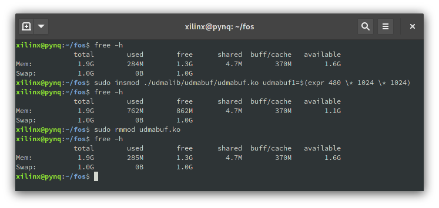

# Memory usage

This page describes how the memory is allocated both in the DDR and how the writes to the registers take place.

## Loading bitstreams

In this C++ program we are using the [Cynq](https://github.com/FPGA-Research-Manchester/fos/blob/fdac37e188e217293d296d9973c22500c8a4367c/cynq/cynq.h) library from FOS. To use it follow this example:

```C++
// Instantiate PRManager and StaticAccelInst classes to have access to the register space
PRManager pr_manager;
// Load the bitstream by using a filename from the repo.json file
StaticAccelInst accelerator_instance_= prmanager.fpgaLoadStatic("DSPI_filtering");

// Other code

// To access register data for reads or writes.
accelerator_instance_->pr_manager->accelRegs[register_offset_address/ 4] = register data
```

In DBMStoDSPI the two instances are stored in the [MemoryManager class](../src/dbmstodspi/query_execution/table_data/memory_manager.hpp). The MemoryManager is instantiated at the beginning of the scheduling process in the [ExecutionManagerFactory class](../src/core/core_execution/execution_manager_factory.cpp) and is kept in memory throughout the process. The pointer to the MemoryManager instance is used in all module driver code to access configuration registers for both read and write operations. 

## Pinning DDR memory on the FPGA

But register space memory is not the only memory area we want to access. We also need access to the DDR memory of the board. This is required to stream larger datasets through the interface on the FPGA. For this we are using the [Udmalib](https://github.com/FPGA-Research-Manchester/fos/blob/fdac37e188e217293d296d9973c22500c8a4367c/udmalib/udma.h) library from FOS. An example on how the memory area accessible through the *udmabuf* device can be used:

```C++
// Instantite repo.
UdmaRepo repo;
// Get devices.
UdmaDevice* input_device = repo.device(0);
UdmaDevice* output_device = repo.device(1);
//For allocating memory. Input and output can be written and read from.
volatile uint32_t* input = (uint32_t*)input_device->map();
volatile uint32_t* output = (uint32_t*)output_device->map();
//Physical addresses for HW to read and write the same data as SW.
volatile uint32_t* input_data_phy =
    reinterpret_cast<volatile uint32_t*>(input_device->phys_addr);
volatile uint32_t* output_data_phy =
    reinterpret_cast<volatile uint32_t*>(output_device->phys_addr);
```

The UdmaDevice can be used to check the allocated memory size as well. The UdmaRepo just finds the "*/sys/class/udmabuf/udmabuf[n]*" devices to allocate memory and stores all of these instances.

How much memory is allocated by the UdmaDevices per *map()* function call is defined in the [setupUdma.sh](https://github.com/FPGA-Research-Manchester/fos/blob/f457cc33e99c606ca18e06abd669c237b71055ba/udmalib/setupUdma.sh#L2) script. How many devices will be available is also defined in the same script. This *setupUdma.sh* has to be run on the system before running this application. The script will use the **insmod** command to create the *udmabuf* devices. To remove the new devices the **rmmod** command can be used. How to add and remove devices is demonstrated in the below image:



These device allocations should also be visible with the **dmesg** command. To see how much memory is available and how much of that is used by the *udmabuf* devices the following command can be used: 

```
cat /proc/meminfo | grep -i cma
```

### But how can I use even more memory?

Now to explain in more detail what does this *udmabuf* device actually do. Here is the documentation for the renamed [udmabuf library](https://github.com/ikwzm/udmabuf). 
"*u-dma-buf is a Linux device driver that allocates contiguous memory blocks in the kernel space as DMA buffers and makes them available from the user space*"
This contiguous memory block can only be allocated in the *cma* space. This *cma* space is in the kernel space. For 32-bit processors with 4 GB of memory it's 1GB kernel space and 3GB userspace. For 64-bit it's fifty-fifty. The ZCU102 used for this development uses a 64-bit processor. So we should be able to use up to 2GB memory. Problem is that kernel space is used for other stuff as well including configuring the FPGA. Thus we tested changing the size of the *cma* in the kernel space. Up to 1792m *cma* size was successfully configured. 

The parameter was found from [this Android document](https://android.googlesource.com/kernel/exynos/+/android-exynos-3.4/Documentation/contiguous-memory.txt?fbclid=IwAR3aeX64eQU6sRFk3v_BzjHhtAP08om-5qfM91ztbjUoCQrQJmFopKlJlGY#310). How the bootimage can be changed is using **u-boot-tools** and **device-tree-compiler**. Then the following script can be used to unpack the boot image into the *kern.img* and the device tree file (DTB). The DTB file is also converted then into a human readable DTS file for us the edit.

```Shell
#!/bin/bash
set -ex

UBOOT=/boot/image.ub
INDEX_KERN=0
INDEX_DT=1

echo Extracting device tree binary
dumpimage -T flat_dt -p $INDEX_DT -i $UBOOT ./system.dtb
dumpimage -T flat_dt -p $INDEX_KERN -i $UBOOT ./kern.img

echo Converting to device tree source
dtc -I dtb -O dts ./system.dtb -o ./system.dts
```

Then the *bootargs* parameter can be changed by appending "cma=1792m" to set the *cma* size. Next the device tree has to be packed with the kernel image again. Then the current boot image needs to bet overwritten. All that can be done with this script:

```Shell
#!/bin/bash
set -ex

UBOOT=/boot/image.ub
INDEX_KERN=0
INDEX_DT=1

echo Converting to device tree binary
dtc -I dts -O dtb ./system.dts -o ./system_out.dtb

echo make uboot image
mkimage -f ./image.its ./image.ub

echo backup uboot image
sudo cp $UBOOT "./.image.ub.$(date).bak"

echo install new uboot image
sudo cp ./image.ub $UBOOT
```

You can see that you need an image.its file. For different boards more its files are available in the FOS [GitHub](https://github.com/FPGA-Research-Manchester/fos/blob/fdac37e188e217293d296d9973c22500c8a4367c/sd_card_images/build/PYNQ/sdbuild/boot/image_aarch64.its). The contents of this file should be the following with the corresponding file names from the previous scritps:

```
/dts-v1/;
 
/ {
    description = "U-Boot fitImage for PYNQ arm kernel";
    #address-cells = <1>;
 
    images {
        kernel@0 {
            description = "Linux Kernel";
            data = /incbin/("./kern.img");
            type = "kernel";
            arch = "arm64";
            os = "linux";
            compression = "none";
            load = <0x80000>;
            entry = <0x80000>;
            hash@1 {
                algo = "sha1";
            };
        };
        fdt@0 {
            description = "Flattened Device Tree blob";
            data = /incbin/("./system_out.dtb");
            type = "flat_dt";
            arch = "arm64";
            compression = "none";
            hash@1 {
                algo = "sha1";
            };
        };
    };
    configurations {
        default = "conf@1";
        conf@1 {
            description = "Boot Linux kernel with FDT blob";
            kernel = "kernel@0";
            fdt = "fdt@0";
            hash@1 {
                algo = "sha1";
            };
        };
    };
};
```

After rebooting the system, the **cmdline** value should be like the following:

```Shell
cat /proc/cmdline
root=/dev/mmcblk0p2 rw earlyprintk rootfstype=ext4 rootwait devtmpfs.mount=1 uio_pdrv_genirq.of_id="generic-uio" clk_ignore_unused cma=1792m
```

## How the FOS libraries have been modified

To increase the register space managed by the PRManager the FOS libraries were changed a little bit. Some of the included libraries were changed and paths were updated. But most importantly the *PRManager::fpgaLoadStatic* method was changed to have an additional size parameter to be used with the *mmioGetMmap* method instead of the hardcoded 4096. Some of the checks were commented out as well since we are loading full bitstreams each time currently. Everything else is the same as in the original FOS repository.

[Back to the main page](./README.md)