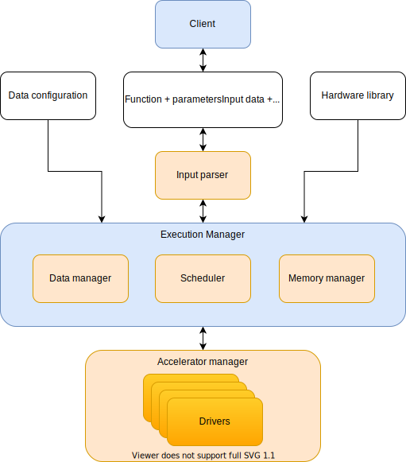

# Vision

This document is a collection of thoughts where the project could lead up to. The main reason for this is to identify the main building blocks of this infrastructure and motivate and guide further generalisation. The next step would be to solidify the interfaces between different blocks. To do that in an educated way multiple different usecases have to be implemented using this infrastructure to help define the interface between different blocks.

## Main building blocks

What is the main goal for this sort of infrastructure? The first specific case is to accelerate DBMSs. It a good target because DBMS operations vary greately and there are a lot of decisions to make for the scheduler. But you should be able to also run multiple queries at the same time. Now the FPGA resources have to be utilised as well as possible for good performance per watt metrics. To do that it would make sense to make a library of modular accelerators to be placed in a runtime configurable pipeline. And that packing should be as dense as possible to perform as many computing operations per data transfer. This will alleviate the data transfer bottleneck. Thus we have a scheduler to place smaller highly optimised modules in hardware with configuration data based on input data. With this we can start using the platform for problems other than DBMS query acceleration. Below you can see an generalised image of the main building blocks:



The blue blocks are the client and then the service provider. The white blocks are the inputs to the program. Orange blocks are parts of the infrastructure which can be completely swapped out for different problems but the relationship and interface between them stays the same.

### Client

The client in our initial target is a DBMS. It could be any DBMS with some wrapper or translating program to transform the data into the correct format. But in theory it could be any client program or even simply a GUI program to interact with the platform to test out HW modules. The job of the client is to simply pass function and data parameters to the application. The rest of the configuration should be done compile time and during deployment. 

### Input

The current near future specifications for the [client input & hardware library](./program_input.md) and [data configuration](./input_data_configuration.md) have been described in their respective documentation pages. Here it is important to mention that these could look slightly different based on which implementations of the base blocks have been chosen. 

When it comes to function and input data + parameters then here the tree of operations should be parsed in preorder rather than in the current postorder traversal. The input data can be another function and this tree can go however deep it needs to be. So parsing should start at the root rather than at the leaves. Additionally, the necessity of parameters can be up to the chosen input parser and different blocks of the execution manager. Many of these parameters could be chosen by the scheduler instead when it comes to resource elasticity, for example. There is also a third set parameters missing from this input which should be entirely generated within the execution manager and those are the stream parameters. How big is a stream or a record and how are the IDs allocated.

The data configuration and hardware library are rather free-form inputs and problem dependent. But roughly the current format should suffice.

### Input parser

The input parser is the first swappable building block. Currently the input parser doesn't even exist as the input is hard-coded. The input parser checks that the data is correct and creates the tree of operations to be executed by the execution manager. 

Does the input parser need to be a swappable block if it could just be generalised? Yes, the input parser should still be generalised but if the client DBMS doesn't want to execute the queries but just simply wants a **cost estimation**. Then a different input parser with the exact same interface could be used which is optimised for returning the cost estimation as fast as possible. Another example could be if the input data needs **different amount of parameters**. One parser could be slightly optimised to only accept smaller amounts of parameter lists while another one could be a bigger parser for more costumisable hardware where multiple vectors of configuration data is required in the input already. 

This distinction is important since the input parameters should all go into different memory spaces in the hardware. You can also spot that the accelerator manager could be swappable. Could be that different accelerator managers would work with specific input parsers. Input parsers could verify that the input parameters are given in the correct format as in the stream parameters are in the first slots and the resource elasticity defining parameters are at the last slots of the configuration vectors.

Having multiple generalised implementations makes it both user friendly by not getting too abstract and still easily maintainable for all kinds of different functionalities the implementations of this platforms should support. In practice, all of these building blocks should be abstract interface classes which have multiple different unit tested implementations. 

### Execution Manager

The execution manager is a more static part of the program which holds everything together and reinforces the interfaces between different base blocks. It takes the data configuration input for the data manager and the parsed input from the input parser and the hardware library such that the memory manager and the scheduler know which bitstreams are available. After scheduling the accelerated operations the data can be passed forward to the accelerator manager and in the end the results can be passed back towards the client.

### Data manager

Currently the data manager translates all kinds of data defined in the data configuration file into 4 byte integers. The data is translated row by row from the input files. What if the data should be stored to RAM **column by column**? Or if the data should get **compressed**? Then a different data manager implementation would be needed. 

### Scheduler

The scheduler could be build in countless different ways so different implementations of the scheduler which all could be configured in some ways as well would be very beneficial. Differen schedulers which concentrate on different optimisation vectors could be compared against each other very easily. Different compiled versions would just have to be benchmarked. In the DBMS case the TPC-H benchmark could be used. And the different schedulers could concentrate on different aspects like **fitting as many different operations** on the same FPGA run as possible or use **larger resource elastic modules**. Other examples would be varying levels of **robustness**, **parallelism** or **parameter generation**.

### Memory manager

The memory manager is another crucial block which handles HW configuration memory and the DDR memory for larger data transfers. Currently both of the memory regions are used using FOS and the udmabuf memory mapped regions as shown below:

```C++
//UDMA: writing to /dev/udmabuf[n] using udma.h
(buffer = (char*) mmap(NULL, size, PROT_READ|PROT_WRITE, MAP_SHARED, fd, 0))
//AccelInst: writing to /dev/mem using mmio.h
mmio.mmap = (char*) mmap(NULL, mmio.size, PROT_READ|PROT_WRITE, MAP_SHARED, mmio.fd, mmio.addr);
```

But what if **another memory pinning library** is used instead. This would mean that another memory manager instance is required which would use something other than FOS. 

One imporant bit to note is that the scheduler, memory manager and data manager will work quite closely with writing and reading input data into DDR memory blocks. This makes the modularisation difficult. First the scheduler orders the operations and then the data manager reads the data and writes the data immediately into the DDR blocks given by the memory manager. What if the data is much more difficult to handle than the scheduler anticipated and will need to change the scheduling? Then the memory manager will have to change the allocated memory blocks as well. This mess could be alleviated if the scheduler estimates the data sizes from the file sizes for example. But error handling still should be present and well defined procedure should be baked into the execution manager.

### Accelerator manager

Last swappable block is the accelerator manager which writes all of the data into the FPGA and also reads out the results. This should be swappable to support different sets of drivers. Could be that some problems work well with **generalised drivers** and then a different accelerator manager is needed. Or in the current implementation the drivers have more **fine grained custom costumisation support** for maintainability and optimisations. 

### Drivers

The current driver set is supposed to support the characteristics described in the [modules documentation](acceleration_modules.md). A more generalised or even more specific driver set would come with a different accelerator manager.

## Conclusion

As a next big step this platform would need an implementation for a different use case. The input files don't have to be as big as they are for DBMS queries. But there could be more. And then there would be a different balance between the amount of bulk data and parameterisation. But the whole platform is similar to SIMD instructions. You just have to setup both the data and the instructions in an optimised pipeline and execute.

Thus the next concrete step would be to redesign the whole stack and move the DSBMS acceleration specifications only to the HW level and keep the upper levels of abstraction generalised. The interfaces and the data structures to do that are explained in the next [end vision specification documentation](./vision_implementation_details.md).

[Back to the main page](./README.md)