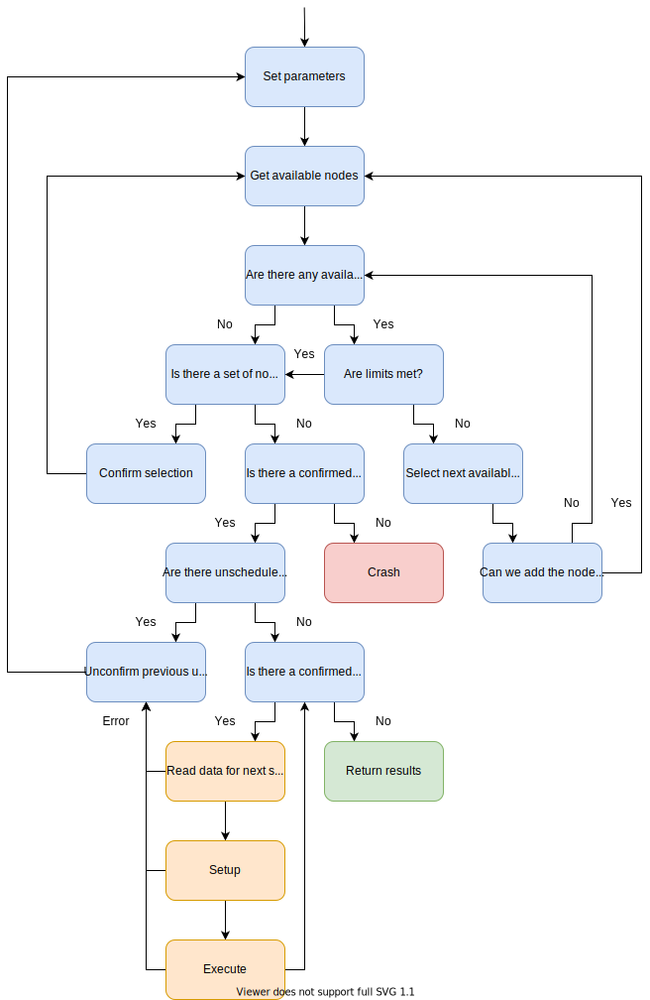

# Generic End Vision Implementation Specifications

In the previous [vision explanation document](./vision.md) we introduced the concept of **general** stream processing acceleration platform. Briefly the idea is to build up the platform with generic replacable managing block modules. Different blocks can be optimised for various problems using different hardware libraries or for different strategies using the same hardware library. Supporting all of these potential manager blocks requires the interfaces between different parts of the platform throughout the stack (including the HW modules themselves) do be defined in a generic and flexible way. Another promise of the proposed platform is that it must still be easy to use. With multiple layers of abstraction and all of the interfaces between the abstraction layers being fully generic the design space grows very large. This makes it difficult to keep most of the designing effort on just solving the problem. With fully generic platforms there is also a lot of designer effort on how to conform with the interfaces and it becomes difficult to scale. 

To summarise, the system promises to be flexible enough to be able to support anything while still being easy enough to use for supporting potentially large complex problem solutions. To show how to deliver on those promises this document we will define all of the datastructures, general data-flow and interfaces between the subparts of the platform.

## General interfaces & datastructures between platform parts

Here we can see the static parts of the system in blue. The replacable parts of the system in orange and the input for each run given in white. How the FSM operates is shown in the next section.

## Extensible data-flow to guarantee deterministic execution

Here we can see the parts of the scheduler in blue and the parts of the data, acceleration and memory manager in yellow. The system will fully exhaust searching all options before crashing unless the input is given in a way such that the different parsers and checkers did not catch any errors. You can now see how different schedulers can implement different strategies. The way how next available nodes or schedule-ready nodes are chosen can be easily costumised without changing how the rest of the system operates on. So it is simple to test and implement new schedulers with wildly different strategies while still avoiding large scale changes to the rest of the platform which is the main goal of the platform. Easy to test out novel acceleration options.

### Example from the DBMS operation acceleration case study

A simple example to show how the FSM and the whole platform works is the following scenario:

1. Assume we have a plan with execution nodes from the scheduler.
2. We have a Join function which uses an interface which requires the data to be formatted: Incrementally sorted based on first column values.
3. Input data is given correctly which is confirmed by the interface the Join method is set to use - as in it is defined that the input data is sorted only up to sequences of 512 records long.
4. The scheduler chooses the MergeSort module which formats the data to be: Incrementally sorted based on first column values.
5. The scheduler can choose multiple HW configurations for this process. The strategy the scheduler is given is the following: It always chooses the option with the least computational capacity which fulfills the requirements. 
6. The memory manager and the data manager read the data and a check of the MergeSort driver returns an error that there are too many records for the chosen HW to handle. The functional capacity is only 64 but for 512 records long sequences 67 channels are required.
7. This scheduled set of operations and all following scheduled operations get removed and the parameters get updated which tell that 67 channels are required.
8. The scheduler still acts exactly the same as before but it also sees that 64 computational capacity is not good enough. So it chooses to use 2 modules instead which gives 128 available channels.
9. The execution goes forward and the data gets returned successfully while using the resources as well as possible given the **HW library**, **driver set** and **strategies** of the different parts of the platform.

[Back to the main page](./README.md)